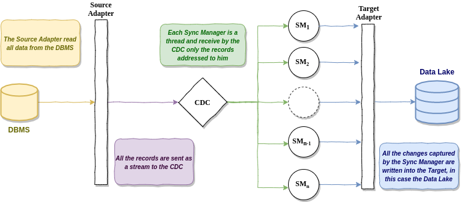
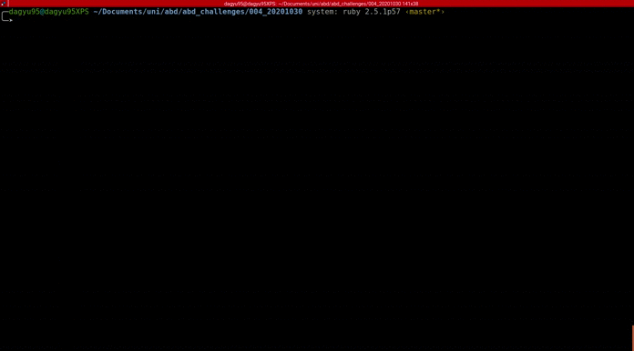

# Challenge 004, Lesson 30/10/2020
This challege was done by:
* Gaetano D'Agostino
* Tommaso Amadori
* Piero Pastore
## Challenge
* Architect and Develop a simple CDC
* Try to create an abstract class containing all the needed
abstract/concrete methods
* With python, use ABC and @abstractmethod

## Architecture
You can view the architecture in the following picture. Essentialy, between the Source (DBMS) and the Target (Data Lake) there are these 4 stage:

* **Source Adapter**: retrieve the data from the source and then emit them as a stream
* **CDC**: read the streamed data and then dispatch them to right Sync Manager using this [procedure](#dispatching-procedure)
* **Sync Manager**: each sync manager has a `sync.json` related and using this he is able to capture the changes.
* **Target Adpater**: receive the data from the sync manager and write them to the Data Lake.




### Dispatching procedure
In order to improve scalability and reduce the cost in case of error we split the `sync.json` file into mulitple `sync.json`, in order to do that we have to ensure that for each round of CDC process the data are associated always to the same `sync.json` (i.e. the association doesn't change over the time). To achieve this goal we simply use the first `m` bit of the hashed key and these bits are the address of the Sync Manager, obviously with `m` bit we must have `2^m` Sync Manager active (in the figure `n=2^m`).

## Implementation

To run a CDC process you have to import [this library](https://github.com/dagyu/cdc) written by us and implement this two `interface`:

* `SourceAdpater`, [this](https://github.com/dagyu/abd_challenges/blob/master/004_20201030/src/main/java/it/unimi/di/abd/SQLAdapter.java) is our implementation that essentialy simulate a stream of data
* `TargetAdapter`, [this](https://github.com/dagyu/abd_challenges/blob/master/004_20201030/src/main/java/it/unimi/di/abd/FSAdapter.java) that essentialy write the output on the filesystem instead of data lake
  
After the implementation with this main the CDC process is able to run.

```java
public static void main(String[] args)  {
   SQLAdapter sourceAdapter = new SQLAdapter();
   FSAdapter targetAdapter = new FSAdapter("/tmp/cdc");
   //directory where sync.json must be saved
   File syncFileDir = new File("/tmp/sync/");
   CDC cdc = new CDC(sourceAdapter, targetAdapter, syncFileDir);
   cdc.run();
}
```

## Run the example on your local machine

### Clone the package
```
git clone git@github.com:dagyu/abd_challenges.git
cd 004_20201030/
```

### Create github token to install the dependencies

To run this example you have to create a github token opening this url [https://github.com/settings/tokens](https://github.com/settings/tokens) and create a token with `read:packages` permission. After that you have to store your token and your username in one of this two ways:
* setting two environment variables: `GITHUB_USERNAME` and `GITHUB_READ_TOKEN`
* create `gradle.properties with this two lines

```
grp.user=YOUR_GITHUB_USERNAME_HERE
grp.read.key=YOUR_GENERATED_TOKEN
```
anyway these strings are read by this code contained in the `build.gradle`:
```
def usernameGithubPackages = project.findProperty("grp.user") ?: System.getenv("GITHUB_USERNAME")
def passwordGithubPackages = project.findProperty("grp.read.key") ?: System.getenv("GITHUB_READ_TOKEN")
```
so you can change this two line.

### Execution

When you have set github token in the right way you can simply execute this command:
```
gradle run
```

